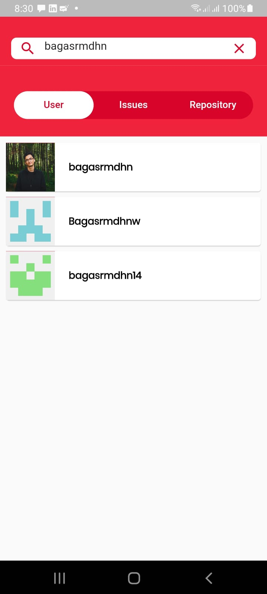
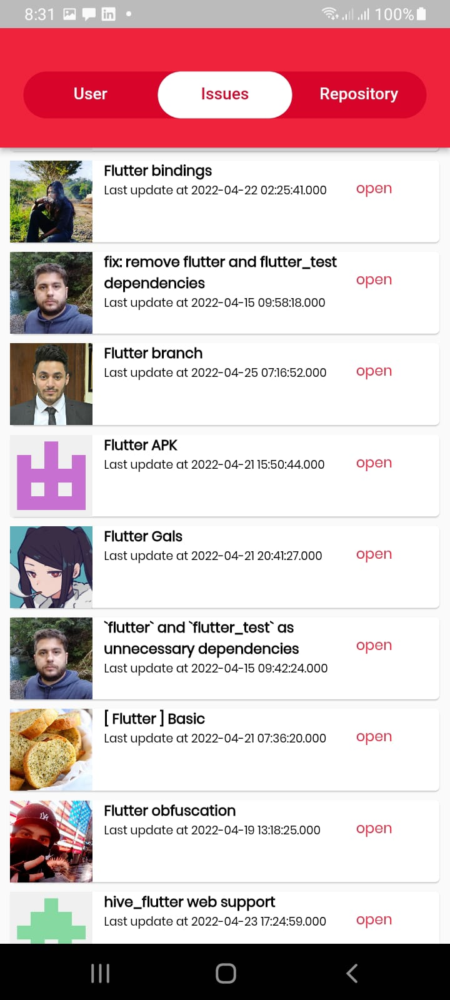
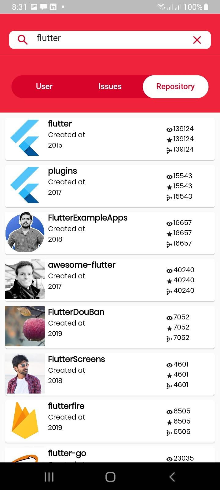
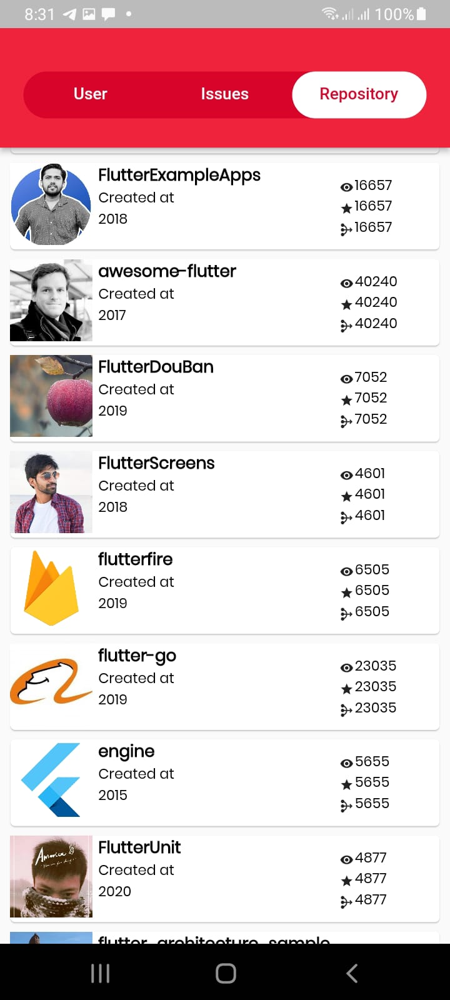

# Github App Flutter

Github App ini merupakan aplikasi yang dibangun menggunakan flutter

## 💡 Background
Aplikasi Github App dibangun sebagai bentuk tes memasuki internship di SejutaCita

## 🤯 Challenges
Ada beberapa kesulitan yang saya hadapi dalam mengerjakan aplikasi ini, yaitu :
- Menggunakan BLoC State Management, saya perlu waktu untuk belajar BLoC terlebih dahulu sebelum mengerjakan tes ini.
- kesulitan dalam mengimplementasikan lazy loading dan list with index nya, sehingga belum terselesaikan
- sedikit kesulitan menggunakan radio button untuk pemilihan filter pencarian, sehingga saya modifikasi menggunakan TabBar
- listview dengan sliver di dalam customScroll belum Nested dengan baik, sehingga memiliki 2 area scrollable(listview item dan bagian tabBar)

## Screen Capture

